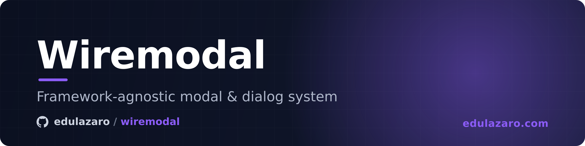

# wiremodal

Framework-agnostic modal/dialog system for Laravel, Livewire and Alpine. Pure CSS themes, custom-theme via CSS variables, drop-in API. Sibling of [wiretoast](https://github.com/edulazaro/wiretoast).

12 themes · 11 sizes · 0 runtime deps · works with or without Livewire/Alpine.

## Install

```bash
composer require edulazaro/wiremodal
php artisan vendor:publish --tag=wiremodal-assets
```

Add to your layout:

```blade
<link rel="stylesheet" href="{{ asset('vendor/wiremodal/css/wiremodal.css') }}">
<script src="{{ asset('vendor/wiremodal/js/wiremodal.js') }}" defer></script>
```

Or import into your Vite bundle (`resources/css/app.css` + `resources/js/app.js`):

```css
@import "../../vendor/edulazaro/wiremodal/resources/css/wiremodal.css";
```
```js
import '../../vendor/edulazaro/wiremodal/resources/js/wiremodal.js';
```

## Define a modal

```blade
<x-wiremodal name="confirm-delete" title="¿Eliminar registro?" size="sm">
    <x-slot:body>
        <p>Esta acción no se puede deshacer.</p>
    </x-slot:body>
    <x-slot:footer>
        <button type="button" data-wm-dismiss>Cancelar</button>
        <button type="button" onclick="Wiremodal.close('confirm-delete', 'confirmed')">Eliminar</button>
    </x-slot:footer>
</x-wiremodal>
```

## Open / close

### Livewire (PHP)

```php
$this->openModal('confirm-delete');
$this->openModal('edit-task', ['id' => 42, 'title' => 'Buy milk']);
$this->closeModal('confirm-delete');
```

Under the hood these are macros that dispatch `open-wiremodal` / `close-wiremodal` browser events. If you prefer the raw form:

```php
$this->dispatch('open-wiremodal', 'confirm-delete');
$this->dispatch('open-wiremodal', name: 'edit-task', data: ['id' => 42]);
$this->dispatch('close-wiremodal', 'confirm-delete');
```

### JavaScript (vanilla / Alpine)

```js
Wiremodal.open('confirm-delete');
Wiremodal.open('edit-task', { id: 42, title: 'Buy milk' });
Wiremodal.close('confirm-delete');
Wiremodal.closeAll();
Wiremodal.isOpen('confirm-delete');
```

`Wiremodal.open()` returns a Promise that resolves with the value passed to `Wiremodal.close(name, result)`:

```js
const result = await Wiremodal.open('confirm-delete', { id: 42 });
if (result === 'confirmed') {
    // user clicked the Eliminar button
}
```

Custom events also work directly:

```js
window.dispatchEvent(new CustomEvent('open-wiremodal',  { detail: 'confirm-delete' }));
window.dispatchEvent(new CustomEvent('open-wiremodal',  { detail: { name: 'edit-task', data: { id: 42 } } }));
window.dispatchEvent(new CustomEvent('close-wiremodal', { detail: 'confirm-delete' }));
```

Legacy event names `open-modal` / `close-modal` are accepted too, useful when migrating from ad-hoc implementations.

### From inside the markup

Any element with `data-wm-dismiss` inside a modal closes it (the built-in close X and overlay use this):

```blade
<button data-wm-dismiss>Cancel</button>
```

## Receive the payload inside the modal

The payload passed to `openModal()` / `Wiremodal.open()` is delivered via a `wiremodal:opened` event on the modal element (and on `window`). Read it with Alpine:

```blade
<x-wiremodal name="edit-task" title="Edit task" size="md"
    x-data="{ payload: {} }"
    @wiremodal:opened.window="if ($event.detail.name === 'edit-task') payload = $event.detail.data || {}">

    <x-slot:body>
        <input :value="payload.title" name="title">
    </x-slot:body>
    <x-slot:footer>
        <button data-wm-dismiss>Cancel</button>
        <button @click="$wire.save(payload.id, $event.target.previousElementSibling.value)">Save</button>
    </x-slot:footer>
</x-wiremodal>
```

Or plain JS:

```js
window.addEventListener('wiremodal:opened', e => {
    if (e.detail.name === 'edit-task') {
        console.log(e.detail.data);
    }
});
```

## Sizes

`xs` 20rem · `sm` 24rem · `md` 28rem · `lg` 32rem · `xl` 36rem · `2xl` 42rem (default) · `3xl` 48rem · `4xl` 56rem · `5xl` 64rem · `6xl` 72rem · `7xl` 80rem.

```blade
<x-wiremodal name="x" size="xs">
<x-wiremodal name="x" size="4xl">
<x-wiremodal name="x" fullscreen>
```

## Persistent modals

`persistent` modals ignore overlay clicks and ESC. They only close via explicit `data-wm-dismiss` buttons or programmatic `Wiremodal.close()`. Useful for "must confirm" flows or wizards mid-step.

```blade
<x-wiremodal name="finish-checkout" title="Confirmar pedido" persistent>
    ...
</x-wiremodal>
```

## Block close on unsaved changes

The `wiremodal:beforeclose` event is cancelable. Call `event.preventDefault()` to keep the modal open.

```js
modal.addEventListener('wiremodal:beforeclose', e => {
    if (hasUnsavedChanges) {
        e.preventDefault();
        alert('Save or discard your changes first');
    }
});
```

The event detail includes `reason`: `'programmatic' | 'dismiss' | 'escape'`.

## Themes

Themes are applied via `[data-wire-theme="..."]` on any ancestor (commonly `<html>` or `<body>`). The same theme name applies across the whole `wire*` family.

| Theme | Vibe |
|---|---|
| default | Neutral light/dark, follows system |
| `soft` | Tinted background, no shadow, friendly |
| `glass` | Frosted backdrop blur |
| `gradient` | Vivid linear gradient panel, white text |
| `neon` | Dark panel, glowing accent border, mono font |
| `minimal` | No shadow, left accent stripe |
| `claude` | Warm minimal, Anthropic-inspired |
| `chatgpt` | Rounded, soft, large radius |
| `synthwave` | Retro 80s purple/magenta neon |
| `megaflow` | Flowbite-style: clean white card |
| `brutalist` | 1px black border, hard offset shadow, hover lift |
| `toxic` | Swamp dark, lime accent; dark only |

```html
<html data-wire-theme="claude" data-wire-theme-mode="light">
```

Dark mode: set `data-wire-theme-mode="dark"` or add `.dark` class to ancestor.

## Custom theme

Define your own by setting CSS variables on a scope:

```css
[data-wire-theme="my-brand"] {
    --wire-bg: #fff8f0;
    --wire-text: #2d1810;
    --wire-accent: #ff6b35;
    --wire-radius: 8px;
    --wire-shadow: 0 12px 32px rgba(45, 24, 16, 0.12);
}
```

For modal-specific overrides, use `--wm-*` variables (see `wiremodal.css` for the full list).

## Side nav

Pass a `nav` slot and the panel becomes two columns: a fixed sections column and
the content. The nav runs the full height of the panel and sits outside the body's
scroll, so the sections stay reachable however long the content is.

```blade
<x-wiremodal name="settings" size="5xl" title="Settings">
    <x-slot:nav>
        <div class="wm-nav-group">
            <span class="wm-nav-label">Account</span>
            <button type="button" class="wm-nav-item is-active" aria-current="page">
                <span>General</span>
            </button>
            <button type="button" class="wm-nav-item"><span>Privacy</span></button>
        </div>

        <div class="wm-nav-group">
            <span class="wm-nav-label">Subscription</span>
            <button type="button" class="wm-nav-item"><span>Plan</span></button>
            <button type="button" class="wm-nav-item"><span>Usage</span></button>
            <button type="button" class="wm-nav-item"><span>Invoices</span></button>
        </div>
    </x-slot:nav>

    <x-slot:body>
        ...
    </x-slot:body>
</x-wiremodal>
```

| Part | What it is |
|---|---|
| `.wm-nav-group` | A block of entries. Consecutive groups are spaced apart. |
| `.wm-nav-label` | The group heading. Hidden on phones, where the nav is a row. |
| `.wm-nav-item` | One entry: `button` or `a`, one line, an optional leading `svg`. Mark the current one with `aria-current="page"` or `.is-active`. |
| `.wm-nav-top` | Optional fixed strip at the top (a search box), with `.wm-nav-list` holding the scrolling entries. |

A modal with a nav keeps a fixed height (`--wm-nav-panel-height`) so the column
does not grow and shrink as you move between sections. On phones the nav turns
into a scrollable row of entries and the panel goes back to its own height.

Sizing and colours come from `--wm-nav-*`; the full list is in `wiremodal.css`.

## Scrollbars

The body and the nav get a thin scrollbar in every theme, because the browser's
own is about twice as thick and square, and looks nothing like the host app. The
thumb is derived from the theme's text colour, so it follows light and dark on its
own; `--wm-scrollbar-size`, `--wm-scrollbar-thumb` and `--wm-scrollbar-thumb-hover`
override it.

## Anatomy

```
.wm-modal[data-wm-name][data-wm-state="open|closed"][data-wm-size][data-wm-fullscreen][data-wm-persistent][data-wm-nav]
    .wm-overlay[data-wm-dismiss]
    .wm-panel
        .wm-nav                     (only with a `nav` slot)
            .wm-nav-top
            .wm-nav-list
                .wm-nav-group
                    .wm-nav-label
                    .wm-nav-item[aria-current="page"]
        .wm-content
            .wm-header
                .wm-title
                .wm-close[data-wm-dismiss]
            .wm-body
            .wm-footer
```

Lifecycle events (fire on both modal element and window):

| Event | Cancelable | `detail` |
|---|---|---|
| `wiremodal:beforeclose` | yes | `{ name, reason }` |
| `wiremodal:opened` | no | `{ name, data }` |
| `wiremodal:closed` | no | `{ name, result }` |

## Sponsors

Wiremodal is supported by the following sponsors. Thank you for keeping it growing:

<p>
  <a href="https://kenodo.com"></a>&nbsp;<a href="https://kenodo.com">Kenodo</a>&nbsp;&nbsp;&nbsp;&nbsp;
  <a href="https://andorradev.com"></a>&nbsp;<a href="https://andorradev.com">AndorraDev</a>
</p>

## Author

Created by [Edu Lazaro](https://edulazaro.com)

## License

Wiremodal is open-sourced software licensed under the [MIT license](LICENSE).
